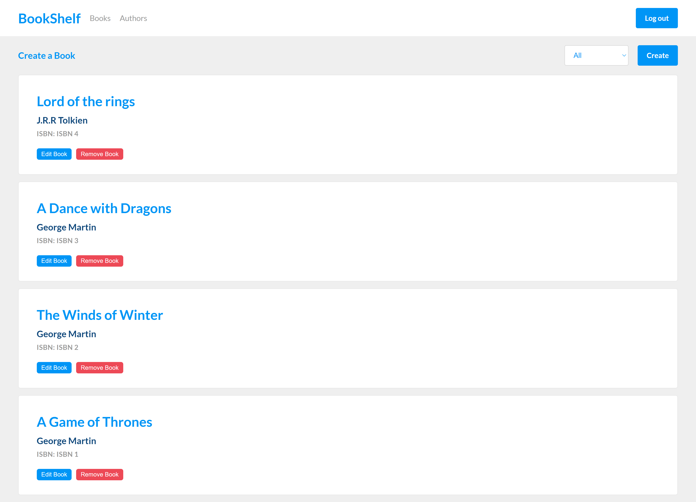

# Bookshelf - All in one Book/Author management

[Bookshelf - Live Link](https://holidog-exercise.herokuapp.com/)



## Table of content

- [Description](#description)
- [Technologies](#technologies)
- [Installation](#installation)
- [Contact](#contact)

## Description

Bookshelf is an author/book management app built using the MERN stack. It impliments the following API endpoints:

- **GET /books/** - Returns a list of books in the database in JSON format
- **GET /books/{{id}}/** - Returns a detail view of the specified book id. Nest author details in JSON format
- **GET /authors/** - Returns a list of authors in the database in JSON format
- **GET /authors/{{id}}/** - Returns a detail view of the specified author id
- **POST /authors/** - Creates a new author with the specified details
- **POST /books/** - Creates a new book with the specified details
- **PUT /authors/{{id}}** - Updates an existing author
- **PUT /books/{{id}}** - Updates an existing book

Login details are available (However, you're encouraged to create a new account)

- Email: holidog@gmail.com
- Password: password

## Technologies

The project is built using the MERN Stack.

#### Express, MongoDB, Mongoose, NodeJS

- API
  `CRUD`, `Projection`, `Sorting`, `modelling`, `populating`
- Authentication
  `sign-up`, `login`, `authentication`
- Security
  `cors`, `rate limiting`, `cookie`, `http headers`, `data sanitize`, `parameter pollution prevention`
- Advance Error Handling
- Testing
  `jest`, `supertest`

#### React

- `ReactJS`, `Redux`, `SASS`, `reselect`, `code splitting`, `testing`

## Installation

Config file is not ignored from the repo, so the installation is quite straight forward.

1. Clone the project to your local directory

```
git clone https://github.com/KaushikShivam/holidog-challenge
```

2. The project uses NPM for managing dependencies. Run npm install to install all the required dependencies. Do the same in the client directory

```
npm install
```

3. Run the following runner

```
npm run dev
```

## Contact

You can contact me at:

- [Portfolio](www.shivamkaushik.com)
- [Email](shivamkaushikofficial@gmail.com)
- [Linkedin](https://www.linkedin.com/in/kshivamdev/)
- [Twitter](https://twitter.com/kShivamDev)
- [Medium](https://medium.com/@shivamkaushikofficial)
- [Angellist](https://angel.co/kshivamdev)
